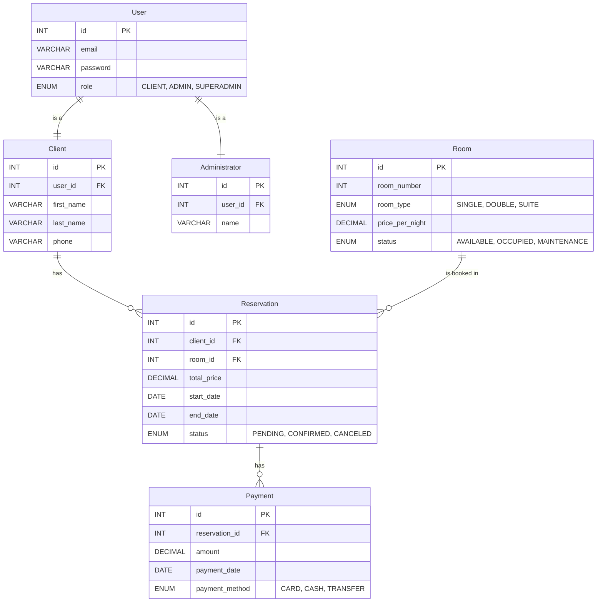
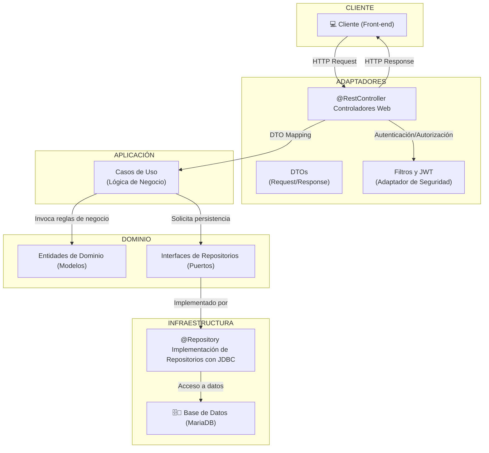
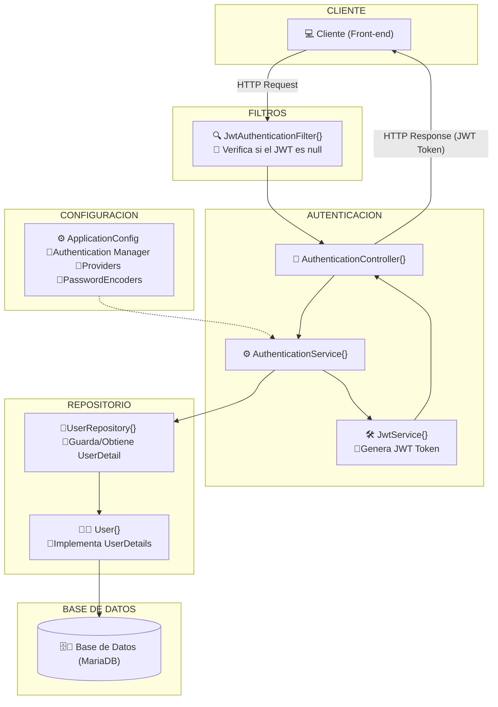
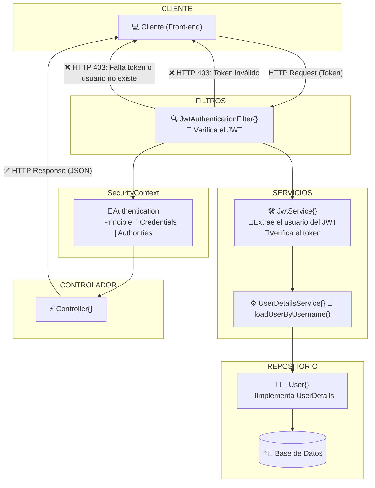

# HotelManagementAPI - Ejercicio de DeHaroHub
¡Hola y bienvenido!
Este desarrollo se trata de un ejercicio propuesto en la comunidad de Skool DeHaroHub por Nacho De Haro (el creador de la comunidad) en [este repositorio](https://github.com/Deharotech/DHHotel). En el propio enunciado pone que se debe realizar una PR en ese mismo repositorio para que él lo vea. Pero como la comunidad esta inactiva y su creador esta a otras cosas he optado por publicar mi desarrollo en es repositorio.

## Índice

- [Descripción](#descripción)
- [Objetivo](#objetivo)
- [Características Funcionales](#características-funcionales)
- [Requerimientos Técnicos](#requerimientos-técnicos)
- [Arquitectura del Proyecto](#arquitectura-del-proyecto)
- [Tecnologías Utilizadas](#tecnologías-utilizadas)
- [Instalación y Configuración](#instalación-y-configuración)
  - [Requisitos Previos](#requisitos-previos)
  - [Configuración de Docker](#configuración-de-docker)
  - [Ejecutar la API](#ejecutar-la-api)
- [Documentación de la API](#documentación-de-la-api)
- [Pruebas](#pruebas)
- [Desafíos Adicionales y Mejoras Futuras](#desafíos-adicionales-y-mejoras-futuras)
- [Contribuciones](#contribuciones)
- [Licencia](#licencia)

## Descripción

Esta API RESTful permite la gestión completa de un hotel, incluyendo la administración de clientes, habitaciones, reservas, pagos y administradores. Se ha desarrollado utilizando Java con Spring Boot, aplicando los principios de una arquitectura limpia para separar la lógica de negocio del acceso a datos y la presentación.

## Objetivo

El objetivo de este proyecto es crear una API para la gestión de un hotel que permita:

- Manejar reservas, habitaciones, pagos, clientes y administradores.
- Implementar la lógica de negocio, estructuras de datos y endpoints necesarios.
- Mejorar las habilidades en la creación de APIs RESTful, manejo de bases de datos y aplicación de buenas prácticas en arquitectura de software.

## Características Funcionales

### Clientes
- **CRUD**: Crear, leer, actualizar y eliminar clientes.
- **Campos obligatorios**: ID, Nombre, Apellidos, Correo electrónico, Número de teléfono.

### Habitaciones
- **CRUD**: Crear, leer, actualizar y eliminar habitaciones.
- **Campos obligatorios**: ID, Número de habitación, Tipo de habitación (simple, doble, suite), Precio por noche, Estado (disponible, ocupada, en mantenimiento).

### Reservas
- **CRUD**: Crear, leer, actualizar y cancelar reservas.
- **Campos obligatorios**: ID, ID del cliente, ID de la habitación, Fecha de inicio, Fecha de fin, Estado (pendiente, confirmada, cancelada).

### Pagos
- **Registro de pagos**: Asociados a una reserva.
- **Campos obligatorios**: ID, ID de la reserva, Monto, Fecha de pago, Método de pago (tarjeta, efectivo, transferencia).

### Administradores
- **CRUD**: Crear, leer, actualizar y eliminar administradores.
- **Campos obligatorios**: ID, Nombre, Correo electrónico, Contraseña (hasheada), Rol (admin, superadmin).

### Autenticación y Autorización
- Implementación de autenticación JWT para administradores.
- Solo los administradores pueden crear, actualizar o eliminar habitaciones y reservas.
- Los clientes pueden crear y ver sus reservas, pero no modificarlas una vez confirmadas.

## Requerimientos Técnicos

- **Lenguaje y Framework**: Java con Spring Boot.
- **Base de Datos**: MariaDB ejecutado en un contenedor Docker, con un script sql para crear y poblar las tablas de la base de datos.
- **ORM**: No he usado ningún ORM en su lugar he usado JDBC de manera directa ya que es más flexible.
- **Contenedores**: Docker para MariaDB y Adminer.
- **Documentación**: Swagger/OpenAPI para la documentación de la API.
- **Pruebas**: Pruebas unitarias e integración.

## Diagrama Entidad-Relación de la Base de Datos de la API



## Arquitectura del Proyecto

El proyecto está organizado siguiendo una arquitectura limpia:

- **Adaptadores**:  
  - Controladores REST para recibir peticiones y enviar respuestas.
  - DTOs para el mapeo de datos entre la API y la lógica de negocio.
  - Adaptador de seguridad (JWT, filtros, etc.).
  
- **Aplicación**:  
  - Casos de Uso que orquestan la lógica de negocio.

- **Dominio**:  
  - Entidades de dominio (Modelos) y lógica de negocio.
  - Interfaces de repositorios (Puertos).

- **Infraestructura**:  
  - Implementaciones de repositorios (por ejemplo, con JDBC).
  - Configuración de acceso a la base de datos (MariaDB en Docker).

### Esquema general de la arquitectura



### Esquema del Proceso de Autenticación/Registro basado en JWT (JSON Web Tokens)



### Esquema del Proceso de Validación JWT



## Tecnologías Utilizadas

- **Java 21+**
- **Spring Boot**
- **Spring Security con JWT**
- **JDBC**
- **Docker**  
  - **MariaDB**
  - **Adminer**
- **Swagger/OpenAPI**
- **Gradle**

## Instalación y Configuración

### Requisitos Previos

- JDK 21 o superior instalado.
- Docker y Docker Compose instalados.
- Git instalado.

### Configuración de Docker

El proyecto incluye un archivo `docker-compose.yml` para levantar la base de datos y Adminer. Un ejemplo de `docker-compose.yml` podría ser:

```yaml
version: '3.8'

services:
  mariadb:
    image: mariadb:10.5
    container_name: hotel-mariadb
    environment:
      MYSQL_ROOT_PASSWORD: rootpassword
      MYSQL_DATABASE: hotel_db
      MYSQL_USER: hoteluser
      MYSQL_PASSWORD: hotelpassword
    ports:
      - "3306:3306"
    volumes:
      - db_data:/var/lib/mysql

  adminer:
    image: adminer
    container_name: hotel-adminer
    ports:
      - "8080:8080"

volumes:
  db_data:
```

Para iniciar los contenedores, ejecuta en la raíz del proyecto:

```bash
docker-compose up -d
```

### Ejecutar la API

1. Clona el repositorio:
   ```bash
   git clone https://tu-repo-url.git
   cd nombre-del-repo
   ```

2. Compila y ejecuta la aplicación:
   ```bash
   ./mvnw clean install
   ./mvnw spring-boot:run
   ```
   O, si usas Gradle:
   ```bash
   ./gradlew build
   ./gradlew bootRun
   ```

3. La API estará disponible en `http://localhost:8080`.

## Documentación de la API

La documentación interactiva se genera automáticamente con Swagger. Una vez iniciada la aplicación, puedes acceder a ella en:
- `http://localhost:8080/swagger-ui.html` o
- `http://localhost:8080/swagger-ui/index.html`

## Pruebas

Se han implementado pruebas unitarias y de integración para asegurar el correcto funcionamiento de la API. Para ejecutarlas:

```bash
./mvnw test
```
o
```bash
./gradlew test
```

## Desafíos Adicionales y Mejoras Futuras

- **Optimización de Consultas:** Mejorar el rendimiento en operaciones complejas sobre reservas y habitaciones.
- **Gestión de Estados:** Refinar la lógica de transición de estados en reservas.
- **Manejo de Concurrencia:** Evitar sobre-reservas mediante bloqueos o estrategias de concurrencia.
- **Escalabilidad:** Adaptar la API para despliegues en entornos distribuidos o en la nube.
- **Seguridad:** Mejorar la protección contra ataques (SQL Injection, XSS, etc.) y optimizar el manejo de autenticación y autorización.

## Contribuciones

¡Las contribuciones son bienvenidas! Si deseas colaborar en el proyecto, sigue estos pasos:

1. Realiza un fork del repositorio.
2. Crea una rama para tu funcionalidad: `git checkout -b feature/nueva-funcionalidad`.
3. Realiza tus cambios y haz commit.
4. Envía un pull request describiendo los cambios realizados.

## Licencia

Este proyecto se distribuye bajo la [Licencia MIT](LICENSE).
