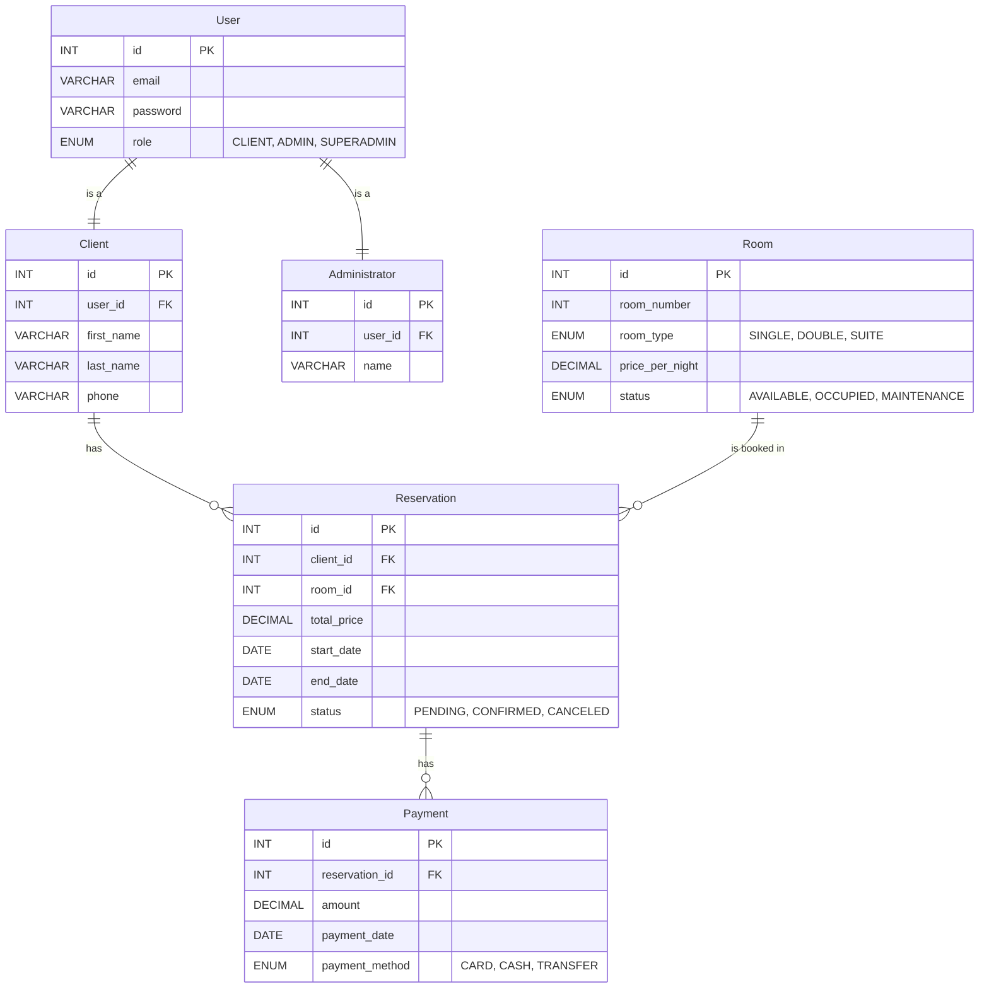
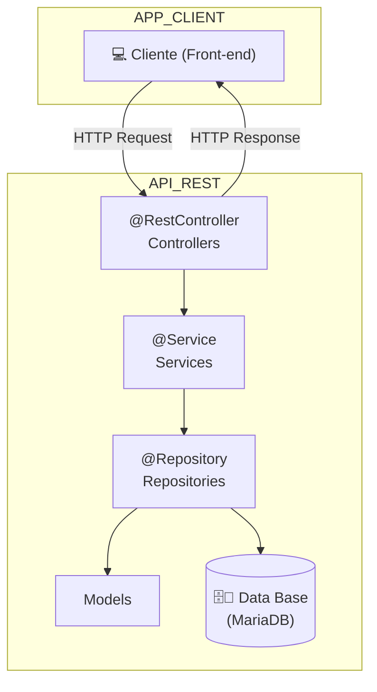
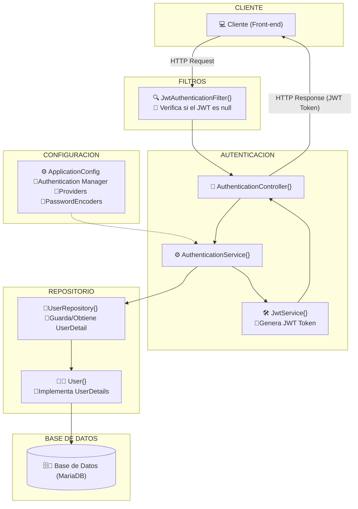
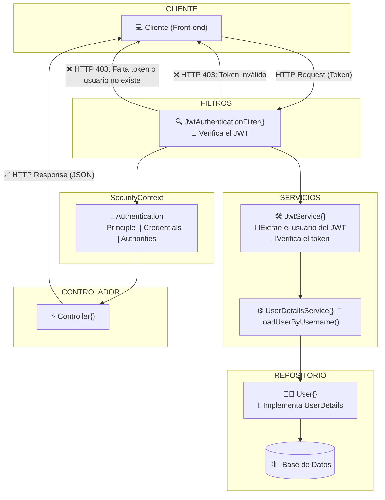

# HotelManagementAPI - Ejercicio de DeHaroHub
API RESTful para la gestión de un hotel, permitiendo administrar reservas, habitaciones, pagos, clientes y administradores, con autenticación, validaciones y documentación en ...

## Diagrama Entidad-Relación de la Base de Datos de la API

## Esquema general de la arquitectura de la API RESTful

## Esquema del Proceso de Autenticación/Registro basado en JWT (JSON Web Tokens)

## Esquema del Proceso de Validación JWT

