# HotelManagementAPI - Ejercicio de DeHaroHub
API RESTful para la gestión de un hotel, permitiendo administrar reservas, habitaciones, pagos, clientes y administradores, con autenticación, validaciones y documentación en ...

## Diagrama Entidad-Relación de la Base de Datos de la API

## Esquema general de la arquitectura de la API RESTful

```mermaid
graph TD;
    subgraph APP_CLIENT
        Client["💻 Cliente (Front-end)"]
    end

    subgraph API_REST
        Controller["@RestController
        Controllers"]
        Service["@Service
        Services"]
        Repository["@Repository
        Repositories"]
        Model["Models"]
        DB[("🗄️🐋 Data Base 
        (MariaDB)")]
    end

    Client -- "HTTP Request" --> Controller
    Controller --> Service
    Service --> Repository
    Repository --> Model
    Repository --> DB
    Controller -- "HTTP Response" --> Client
```

## Esquema del Proceso de Autenticación/Registro basado en JWT (JSON Web Tokens)

```mermaid
graph TD;
    subgraph CLIENTE
        Cliente["💻 Cliente (Front-end)"]
    end

    subgraph FILTROS
        JwtFilter["🔍 JwtAuthenticationFilter{}🔸 Verifica si el JWT es null"]
    end

    subgraph AUTENTICACION
        AuthController["🔐 AuthenticationController{}"]
        AuthService["⚙️ AuthenticationService{}"]
        JwtService["🛠️ JwtService{}
        🔸Genera JWT Token"]
    end

    subgraph REPOSITORIO
        UserRepo["📂UserRepository{} 🔸Guarda/Obtiene UserDetail"]
        User["🧑‍💼 User{}
        🔸Implementa UserDetails"]
    end

    subgraph CONFIGURACION
        Config["⚙️ ApplicationConfig 🔸Authentication Manager 🔸Providers 🔸PasswordEncoders"]
    end

    subgraph BASE DE DATOS
        DB[("🗄️🐋 Base de Datos (MariaDB)")]
    end

    %% Flujo del proceso de autenticación
    Cliente -- "HTTP Request" --> JwtFilter
    JwtFilter --> AuthController
    AuthController --> AuthService
    AuthService --> UserRepo
    UserRepo --> User
    User --> DB

    AuthService --> JwtService
    JwtService --> AuthController
    AuthController -- "HTTP Response (JWT Token)" --> Cliente

    %% Conexiones de configuración
    Config -.-> AuthService
```

## Esquema del Proceso de Validación JWT

```mermaid
graph TD;
    subgraph CLIENTE
        Cliente["💻 Cliente (Front-end)"]
    end

    subgraph FILTROS
        JwtFilter["🔍 JwtAuthenticationFilter{}🔸 Verifica el JWT"]
    end

    subgraph SERVICIOS
        JwtService["🛠️ JwtService{}
        🔸Extrae el usuario del JWT 
        🔸Verifica el token"]
        UserDetailsService["⚙️ UserDetailsService{} 🔸 loadUserByUsername()"]
    end

    subgraph REPOSITORIO
        User["🧑‍💼 User{}
        🔸Implementa UserDetails"]
        DB[("🗄️🐋 Base de Datos")]
    end

    subgraph SecurityContext
        Authentication["🔐Authentication
        Principle  | Credentials | Authorities"]
    end

    subgraph CONTROLADOR
        Controller["⚡ Controller{}"]
    end

    %% Flujo del proceso de validación JWT
    Cliente -- "HTTP Request (Token)" --> JwtFilter
    JwtFilter --> JwtService
    JwtService --> UserDetailsService
    UserDetailsService --> User
    User --> DB

    JwtFilter --> Authentication
    Authentication --> Controller
    Controller -- "✅ HTTP Response (JSON)" --> Cliente

    %% Manejo de errores (403)
    JwtFilter -- "❌ HTTP 403: Token inválido" --> Cliente
    JwtFilter -- "❌ HTTP 403: Falta token o usuario no existe" --> Cliente
```

